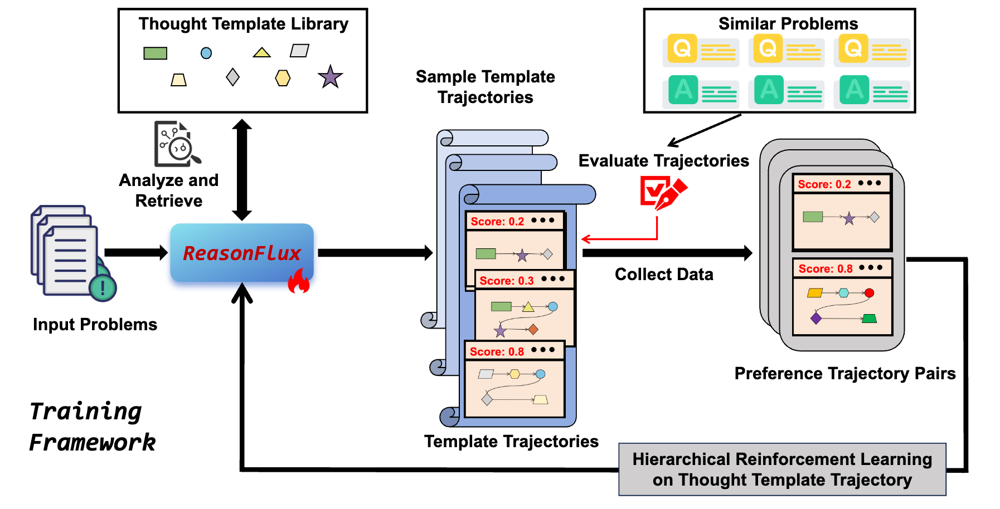
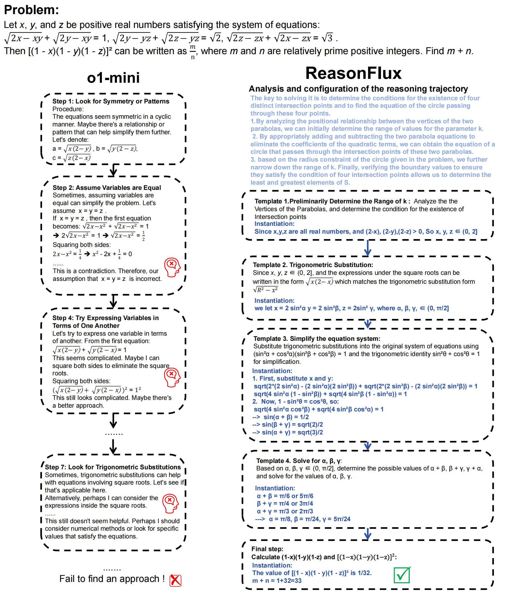

<div align="center">
  <h1>ReasonFlux-v1: Hierarchical LLM Reasoning via Scaling Thought Templates</h1>
</div>


This repository provides official resources for the paper ["ReasonFlux: Hierarchical LLM Reasoning via Scaling Thought Templates"](https://arxiv.org/abs/2502.06772). 

<p align="center">

</p>

## Dataset Links

- **[🤗SFT Data of ReasonFlux-Zero](https://huggingface.co/datasets/Gen-Verse/ReasonFlux_SFT_15k)**

## Getting Started

```bash
conda create -n ReasonFlux_v1 python==3.9
conda activate ReasonFlux_v1
pip install -r requirements.txt
```

## Training
<details>
  <summary>Training ReasonFlux-v1</summary>
  <p>We utilize the open-source framework 
    <a href="https://github.com/hiyouga/LLaMA-Factory">LLaMA-Factory</a> for our training process.
  </p>
      <strong>Step 1:</strong> Add the data path to the <code>file_name</code> field of the ReasonFlux entry in 
      <a href="./LLaMA-Factory/data/dataset_info.json">LLaMA-Factory/data/dataset_info.json</a>.
<br>
      <strong>Step 2:</strong> Run the following command to train from a 32B model on 8 A100 GPUs:
  </ol>
  <pre><code>llamafactory-cli train \
      --stage sft \
      --do_train True \
      --model_name_or_path Qwen/Qwen2.5-32B-Instruct \
      --preprocessing_num_workers 16 \
      --finetuning_type full \
      --template qwen \
      --flash_attn auto \
      --dataset_dir train/LLaMA-Factory/data \
      --dataset ReasonFlux \
      --cutoff_len 2048 \
      --learning_rate 2e-05 \
      --num_train_epochs 3.0 \
      --max_samples 100000 \
      --per_device_train_batch_size 4 \
      --gradient_accumulation_steps 8 \
      --lr_scheduler_type cosine \
      --max_grad_norm 1.0 \
      --logging_steps 5 \
      --save_steps 100 \
      --warmup_steps 0 \
      --packing False \
      --report_to none \
      --output_dir saves/Qwen2.5-32B-Instruct/full \
      --bf16 True \
      --plot_loss True \
      --trust_remote_code True \
      --ddp_timeout 180000000 \
      --optim adamw_torch \
      --deepspeed cache/ds_z3_offload_config.json
  </code></pre>
</details>

## **Inference**

When you complete your first-stage training, you can try to use simple lines of codes to conduct reasoning based on few lines of code.

```python
from reasonflux import ReasonFlux

reasonflux = ReasonFlux(navigator_path='path-to-navigator',
                        template_matcher_path='jinaai/jina-embeddings-v3',
                  		inference_path='path-to-infernece-model',
                        template_path='template_library.json')
problem = """Given a sequence {aₙ} satisfying a₁=3, and aₙ₊₁=2aₙ+5 (n≥1), find the general term formula aₙ"""
```

`navigator_path` is the path to the navigator, you can put the path to your trained LLM after SFT-stage here.

`template_matcher_path` is the path to the embedding model, you can set the path to your local embedding model or download [jina-embedding-v3](https://huggingface.co/jinaai/jina-embeddings-v3) from [huggingface](https://huggingface.co/). 

`inference_path` is the path to the reasoning model, you can choose different-sized LLMs  to test but here we recommend you to choose the same LLMs as the navigator to save memory.

`template_path` is the path to our template library.  When you run the code for the first time, we will encode the template library for efficient query and retrieve and save the embedding in cache, and it is normal the first run will consume longer time in the initialization stage before reasoning.

You can test your trained model after the SFT stage to see if it could retrieve accurate templates given the problem and solve it in our demo implementation.

>🚨 It should be noted that if you choose to use jina-embedding-v3, you have to make sure that you do not install flash-attn in your environment, which will cause conflicts and thus fail to encode the query and the template library. 

## **Peformance**

| Model                      | MATH-500 | AIME 2024 | AMC 2023 | Olympiad Bench | Gaokao En 2023 |
| -------------------------- | -------- | --------- | -------- | -------------- | -------------- |
| DeepSeek-Coder-V2-Instruct | 75.3     | 13.3      | 57.5     | 37.6           | 64.7           |
| Mathstral-7B-v0.1          | 57.8     | 0.0       | 37.5     | 21.5           | 46.0           |
| NuminaMath-72B-CoT         | 64.0     | 3.3       | 70.0     | 32.6           | 58.4           |
| LLaMA3.1-8B-Instruct       | 51.4     | 6.7       | 25.0     | 15.4           | 38.4           |
| LLaMA3.1-70B-Instruct      | 65.4     | 23.3      | 50.0     | 27.7           | 54.0           |
| LLaMA3.1-405B-Instruct     | 73.8     | –         | –        | 34.8           | –              |
| Qwen2.5-Math-72B-Instruct  | 85.6     | 30.0      | 70.0     | 49.0           | 71.9           |
| rStar-Math                 | 88.2     | 43.3      | 80.0     | 63.1           | 78.2           |
| DeepSeek-V3                | 90.2     | 39.2      | 80.0     | 55.4           | –              |
| **ReasonFlux-32B**         | **91.2** | **56.7**  | **85.0** | **63.3**       | **83.6**       |

We can see that,**ReasonFlux-v1** consistently outperforms open-sourced LLMs on most challenging mathematical benchmarks, achieving new SOTA performances with only 32B-Level parameters. 

## Reasoning Example



## Preliminary Work
We build our ReasonFlux mainly based on some preliminary works, such as [Buffer of Thoughts](https://github.com/YangLing0818/buffer-of-thought-llm) and [SuperCorrect](https://github.com/YangLing0818/SuperCorrect-llm).

## Citation

```bash
@article{yang2025reasonflux,
  title={ReasonFlux: Hierarchical LLM Reasoning via Scaling Thought Templates},
  author={Yang, Ling and Yu, Zhaochen and Cui, Bin and Wang, Mengdi},
  journal={arXiv preprint arXiv:2502.06772},
  year={2025}
}
```
